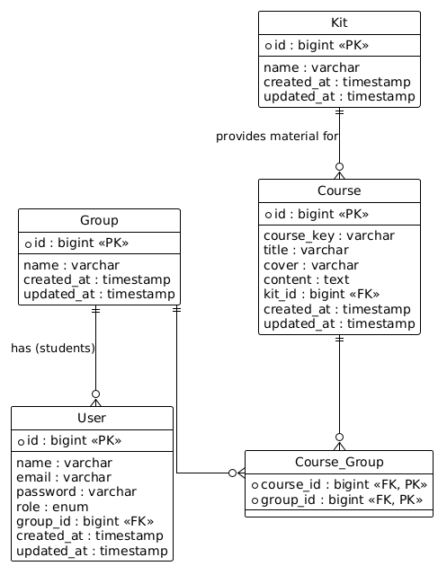

# Activity 7

## Project Description
A small backend system designed for a robotics school to help teachers manage classes and students. It handles user roles (administrative, teacher, student), course management, and didactic material assignments using Laravel and Eloquent ORM.

## ER Diagram

